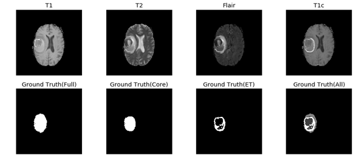

# U-NET Brain Tumor Segmentation of MRI Images

Due to privacy concerns, the main code is redacted and hidden. A cut version is used to display the rough overview of the project.

## Overview
Deep-Learning is a recently booming field, especially in the aspects of Computer Vision with examples such as facial recognition and self-driving cars. One of the explored pathways was inside clinical diagnosis, which is to have a diagnostic tool that acts as a second opinion in determining the tumor of a patient's MRI.
 
This was done with a U-NET model of a Convolutional Neural Network (*CNN*) to learn off existing datasets and have an automatic identifier of the tumor's presence and boundaries, down to the pixel level. This would be done via learning off the BRATS dataset, a challenge made by the MICCAI.

## Quick Breakdown
The dataset is a mix of patients from Malignant/Benign classifications, across synthethicly generated and genuinely recorded MRI scans, which are 3D images as a 2D + channel format. (1 Patient would have around 200x2D images, across 3 axes)
  
<b>Figure 1: </b> Slice overview of a patient.  
The masks are broken into several layers, each per tumor tissue type. These will be binary masks to separate the segmentation N-ways, then combined to form the final segmentation.
  
<b>Figure 2: </b> Dataset Breakdown of layers  
The model uses the 3D U-NET, which is an equal amount of downsampling, basic bottleneck, into equal amount of upsampling layers.